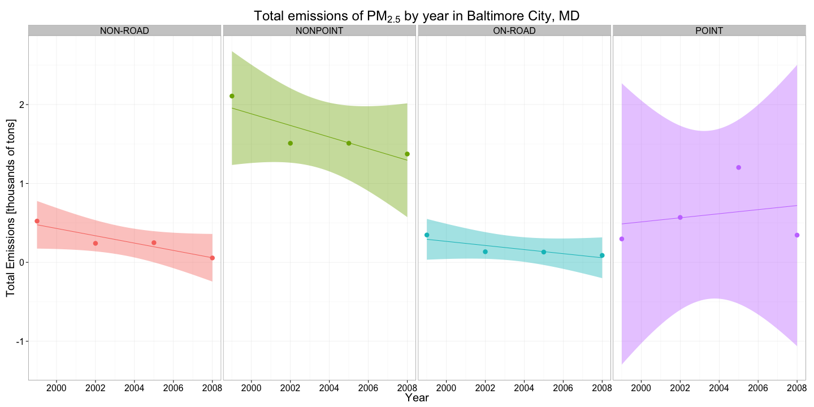
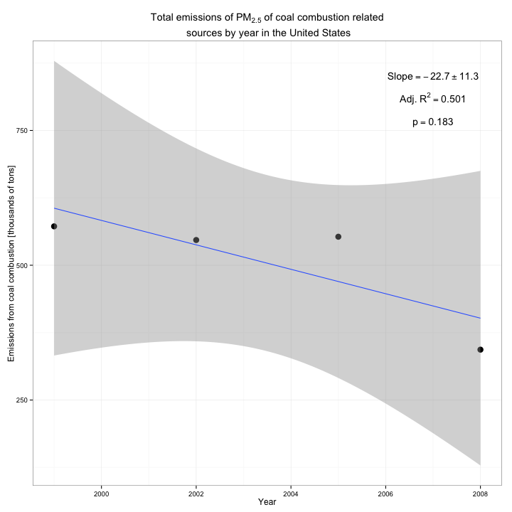
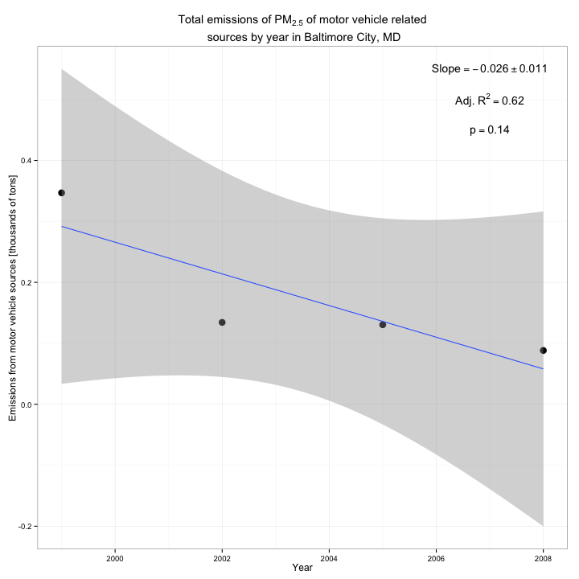
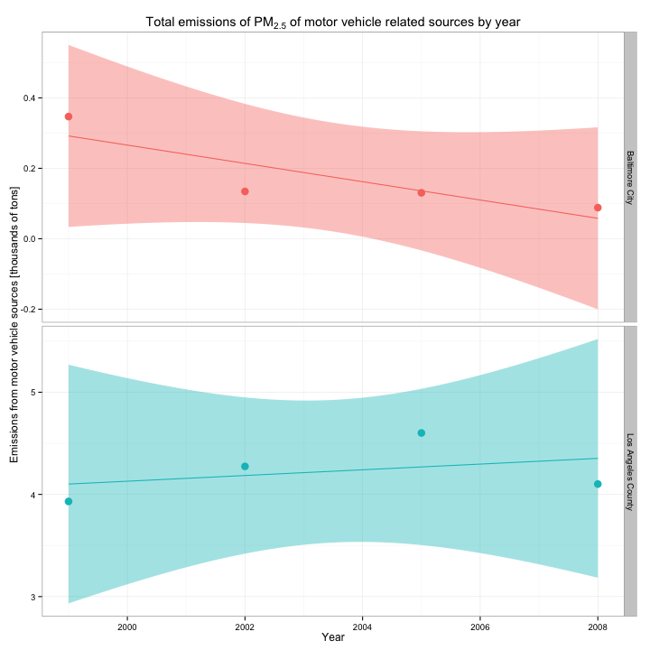

# Project 2


## Description of the data

- fips: A five-digit number (represented as a string) indicating the U.S. county
- SCC: The name of the source as indicated by a digit string (see source code classification table)
- Pollutant: A string indicating the pollutant
- Emissions: Amount of PM2.5 emitted, in tons
- type: The type of source (point, non-point, on-road, or non-road)
- year: The year of emissions recorded

## Read in the data

```
NEI <- readRDS("summarySCC_PM25.rds")
SCC <- readRDS("Source_Classification_Code.rds")
```

## Questions

### Question 1
Have total emissions from PM2.5 decreased in the United States from 1999 to
2008? Using the base plotting system, make a plot showing the total PM2.5
emission from all sources for each of the years 1999, 2002, 2005, and 2008.

This can be done by grouping the NEI data by
- Grouping NEI data by year
- Use the `summarise` function to compute the sum of the emissions for each year (group)
- Plot the output of this `summarise` call


From this plot, we can see the overall PM2.5 emissions across the country are
going down over the years of the study.

### Question 2
Have total emissions from PM2.5 decreased in the Baltimore City, Maryland
(fips == "24510") from 1999 to 2008? Use the base plotting system to make a plot
answering this question.

This is very similar to question 1.

This can be done by grouping the NEI data by
- Filtering the NEI data set, selecting only Baltimore City, MD
- Grouping by year
- Use the `summarise` function to compute the sum of the emissions for each year (group)
- Plot the output of this `summarise` call


From this plot, we can see there is a slight trend downward in the total
emissions of PM2.5 in Baltimore City over the years of the study. The resulting
quality of fit is very poor, so no reliable conclussion can be made using these
data.

### Question 3
Of the four types of sources indicated by the type (point, nonpoint, onroad,
nonroad) variable, which of these four sources have seen decreases in emissions
from 1999–2008 for Baltimore City? Which have seen increases in emissions from
1999–2008? Use the ggplot2 plotting system to make a plot answer this question.

This is done by
- Filtering the data for Baltimore City
- Grouping by year and type
- Use the `summarise` function to compute the sum of the emissions for each year (group)
- Plot the output of this `summarise` call
  - Using the facet_grid geom, we can plot each of the types of polutants on a different facet



The fit quality for all of four emission types is fairly bad, however NON-ROAD and NONPOINT are roughly sloping downward. The other two are consistent with no slope.

### Question 4
Across the United States, how have emissions from coal combustion-related
sources changed from 1999–2008?

This can be done by grouping the NEI data by
- Filtering the NEI data set, selecting only Baltimore City, MD
- Fitlering entries in the NEI data set coming from coal combustion sources
- Grouping by year
- Use the `summarise` function to compute the sum of the emissions for each year (group)
- Plot the output of this `summarise` call



There is a weak downward slope, however the fit is not convincing.

### Question 5
How have emissions from motor vehicle sources changed from 1999–2008 in
Baltimore City?

This can be done by grouping the NEI data by
- Filtering the NEI data set, selecting only Baltimore City, MD
- Fitlering entries in the NEI data set coming from motor vehicle sources
- Grouping by year
- Use the `summarise` function to compute the sum of the emissions for each year (group)
- Plot the output of this `summarise` call



There is a weak downward slope, however the fit is not convincing.

### Question 6
Compare emissions from motor vehicle sources in Baltimore City with emissions
from motor vehicle sources in Los Angeles County, California (fips == "06037").
Which city has seen greater changes over time in motor vehicle emissions?

This can be done by grouping the NEI data by
- Filtering the NEI data set, selecting only Baltimore City, MD and LA
- Fitlering entries in the NEI data set coming from motor vehicle sources
- Grouping by year and city
- Use the `summarise` function to compute the sum of the emissions for each year (group)
- Plot the output of this `summarise` call
  - Using the facet_grid geom, we can plot each city on a different facet



Baltimore has a slight downward slope, however LA is fairly flat. Ultimately, both are roughly consistent with no slope.

