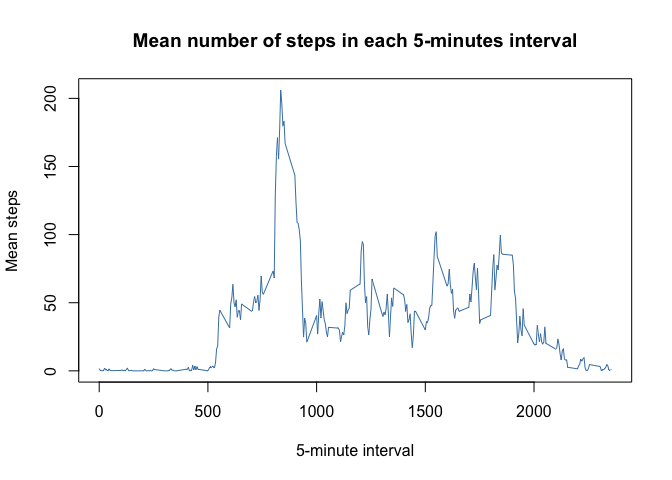
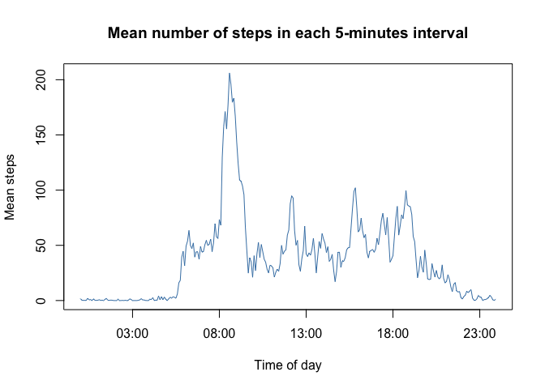
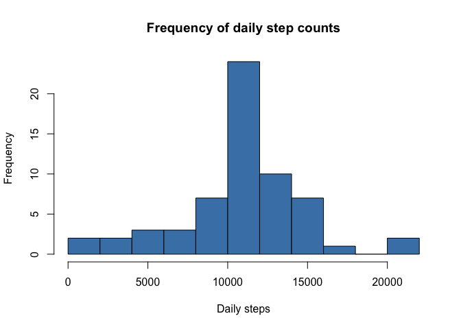

# Reproducible Research: Peer Assessment 1


## Dependencies
This analysis will require the following packages to run:


```r
library(dplyr)
library(ggplot2)
library(scales)
```

## Loading and preprocessing the data
The data for this project is provided in the github repository in a zip
file (`activity.zip`). It is possible to  unzip the data file first, but
that is unnecessary. This will read the zip file, and name the resulting
data frame `activity.data`.


```r
# Read the data frame from a zip file
data.stream <- unz('activity.zip', 'activity.csv')
activity.data <- read.csv(data.stream)

# mutate the data frame to coerce the columns into the desired types
activity.data <- activity.data %>%
  mutate(date = as.Date(date),
         time.interval = as.POSIXct(sprintf('%04d', interval),
                                    format = '%H%M'))
```


## What is mean total number of steps taken per day?

The first interesting thing to look at is the total number of steps taken per
day. To do this, rows with `NA` values will be removed, and the data frame will
be grouped by the date.


```r
# Remove NA values, and find the daily totals
totals.by.day <- activity.data %>%
  filter(!is.na(steps)) %>%
  group_by(date) %>%
  summarise(total = sum(steps))
```

Now, the total total number of steps per day can be plotted


```r
hist(totals.by.day$total, breaks = 10,
     xlab = 'Daily steps',
     main = 'Frequency of daily step counts',
     col = 'steelblue')
```

 


```r
# compute the mean and median of the daily totals
mean.steps <- mean(totals.by.day$total)
median.steps <- median(totals.by.day$total)
```

The mean and median daily step count are 10766.19 and 10765
respectively.


## What is the average daily activity pattern?

Now, in order to determine the most active periods on an average day, intervals
with `NA` step values are dropped, and the data frame is grouped by the
interval number. The data frame is summarized, taking the mean number of steps
at each time interval, averaged over all days.


```r
# again, drop the NA values, and summarize, this time taking the mean number of
# steps for each time interval
mean.by.interval <- activity.data %>%
  filter(!is.na(steps)) %>%
  group_by(interval, time.interval) %>%
  summarise(mean = mean(steps))
```

This gives a plot of the mean number of steps throughout the day.


```r
with(mean.by.interval, plot(interval,
                            mean,
                            type = 'l',
                            xlab = '5-minute interval',
                            ylab = 'Mean steps',
                            main = 'Mean number of steps in each 5-minutes interval',
                            col = 'steelblue'))
```

 

What is more interesting, is to re-cast this in to the time of day to avoid the
strange jumps when the hour changes.


```r
with(mean.by.interval, plot(time.interval,
                            mean,
                            type = 'l',
                            xlab = 'Time of day',
                            ylab = 'Mean steps',
                            main = 'Mean number of steps in each 5-minutes interval',
                            col = 'steelblue'))
```

 


```r
# find the max number of steps, and which interval that occurs in
max.step.interval <- mean.by.interval[[which.max(mean.by.interval$mean),
                                      'interval']]
max.step.time <- mean.by.interval[[which.max(mean.by.interval$mean),
                                  'time.interval']]
max.steps <- max(mean.by.interval$mean)
```

The user's most active interval is interval 835
(08:35), with an average of
206.17 steps in this five minute interval.

## Imputing missing values


```r
num.na.values <- sum(is.na(activity.data$steps))
```

There are 2304 missing values in this dataset.

A straightforward way to fill in these `NA` values is to replace them with the
average number of steps in that interval, averaged over the remaining days.


```r
# extract data frame of entries with NA values
empty.data <- activity.data[is.na(activity.data$steps), ]

# merge this data frame wtih the mean.by.interval data frame to get the mean
# values, then replace the NAs with the mean values and remove the mean column
empty.data <- merge(empty.data, mean.by.interval) %>%
  mutate(steps = mean) %>%
  select(-mean)

# create a data frame with only filled entries, then rbind the formally empty
# data frame to the clean data frame
clean.data <- activity.data[!is.na(activity.data$steps), ]
clean.data <- rbind(clean.data, empty.data)
```

Summarize and group the clean data


```r
clean.totals.by.day <- clean.data %>%
  group_by(date) %>%
  summarise(total = sum(steps))
```

Now, the daily step totals can be plotted as before, but this time with the
average values inputed for the `NA` values.


```r
hist(clean.totals.by.day$total, breaks = 10,
     xlab = 'Daily steps',
     main = 'Frequency of daily step counts',
     col = 'steelblue')
```

 


```r
clean.mean.steps <- mean(clean.totals.by.day$total)
clean.median.steps <- median(clean.totals.by.day$total)
```

The new mean and median daily step count are 10766.19 and
10766.19 respectively. These differs from the original dataset
by 0 and 1.19
respectively.


## Are there differences in activity patterns between weekdays and weekends?

It is interesting to compare the activity patterns between the weekdays and
weekends. In order to do this, it is first necessary to determine which days 
are weekdays or weekends. This can be done using the `weekdays()` function.
The data frame is then grouped based on the day type, and summarized.


```r
GetDayType <- function(day.name) {
  sapply(day.name,
         function(n) {
           if (n %in% c('Saturday', 'Sunday')) 'Weekend' else 'Weekday'
           })
}

mean.by.interval <- clean.data %>%
  mutate(day.name = weekdays(date),
         day.type = GetDayType(day.name),
         day.type = as.factor(day.type)) %>%
  group_by(day.type, time.interval) %>%
  summarise(mean = mean(steps))
```

A plot can be made of the mean number of steps throughout the day,
split into facets, one for weekdays and one for weekends.


```r
g <- ggplot(mean.by.interval, aes(time.interval, mean))
my.plot <- g +
  geom_line(aes(color = day.type)) +
  theme_bw() +
  labs(x = 'Time of day',
       y = 'Mean number of steps',
       title = 'Mean number of steps throughout the day') +
  # facet_grid(.~day.type) +
  facet_grid(day.type~.) +
  theme(legend.position = "none",
        text = element_text(size = 16)) +
  scale_x_datetime(labels = date_format("%H:%M"))

print(my.plot)
```

 

It appears that this user has exercises on weekday mornings. There are fewer large spikes on the weekends, but the overal level appears to be higher.
has fewer large spikes in the weekends.
