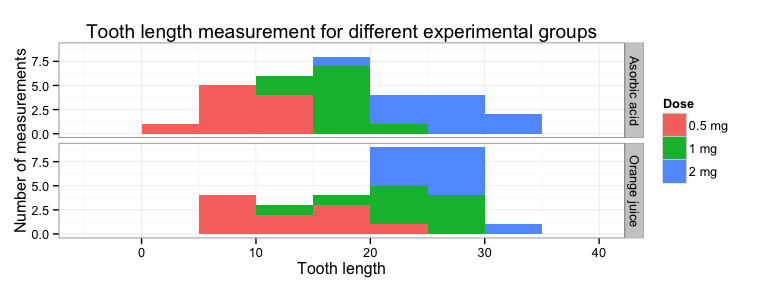
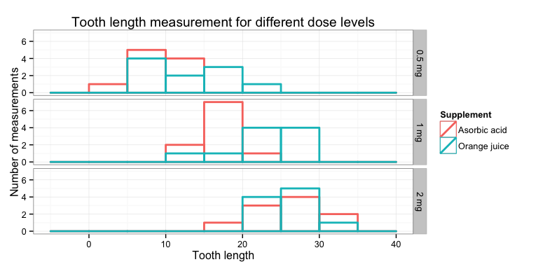

# Exploration of the Expoential Distribution
Brett Jackson  


## Overview
In this study, the effect of different supplements on tooth growth in guinea
pigs is analyzed. The guinea pigs in the study were adminstered different doses
of a supplement; at the end of the study, the teeth were measured and compared.
This goal of this study is to determine if there are significant differences in
effect of the two supplements.


```r
library(ggplot2)
library(datasets)
library(dplyr)
library(xtable)
```

## Summary of data


The ToothGrowth dataset has information about tooth growth in guinea pigs after
the a dose of Vitamin C via one of two delivery methods (orange juice or
ascorbic acid). This dataset contains 60 rows, each
representing a guinea pig subject from the experiment. For each guinea pig,
3 variables are recorded, including the supplement the
subject was administered, the dose, and the resulting tooth length after the
completion of the study.


```r
# mutate the data frame with labels for printing and filtering the dataset
supp.names <- c('OJ'='Orange juice', 'VC'='Asorbic acid')
ToothGrowth <- mutate(ToothGrowth, supp.label=as.factor(supp.names[supp]),
                      dose.label=as.factor(paste(as.character(dose), 'mg')))
```

There are 3 dose levels used for the
experiment including 0.5 mg, 1 mg, 2 mg.
The follwoing plot shows the tooth length as a function of the supplement dose
for each of the supplement types.


```r
ggplot(ToothGrowth, aes(x=dose, y=len)) +
  geom_point(aes(color=supp.label), size=2) + theme_bw() +
  stat_smooth(method=lm, aes(color=supp.label, fill=supp.label)) +
  labs(x='Supplement dose', y='Tooth length', fill='Suplement',
       color='Suplement', title='Tooth length for various doses of a vitamin C')
```

 

At first glance, it is clear that either supplement, increasing the dose is
correlated with higher tooth length. It appears the orange juice has a higher
mean tooth length for all dose levels, however this should be explored more
thoroughly.
The folowing figures show histograms of the measured tooth length divided, first
by the supplement type, then by the dose level.


```r
ggplot(ToothGrowth, aes(x=len)) +
  geom_histogram(aes(fill=dose.label), binwidth=5, size=1) + theme_bw() +
  facet_grid(supp.label~.) +
  labs(x='Tooth length', y='Number of measurements', fill='Dose',
       title='Tooth length measurement for different experimental groups')
```

 


```r
ggplot(ToothGrowth, aes(x=len)) +
  geom_histogram(aes(color=supp.label), binwidth=5, size=1, position='identity',
                 fill='transparent') +
  theme_bw() + facet_grid(dose.label~.) +
  labs(x='Tooth length', y='Number of measurements', color='Supplement',
       title='Tooth length measurement for different dose levels')
```

 

From these figures, it appears that for low doses, the guinea pigs given the 
orange juice supplement have somewhat longer teeth on average, but the
differences become smaller as the dose increases.

## Interpretation
In order to verify the assertions from the simple data exploration above, a
T-test can be used. First, the full populations of guinea pigs given each
supplement are compared to determine if there is an overal difference when using
one supplement or the other.


```r
DoOjVsVcTTest <- function(the.data) {
  # separate the OJ and asorbic acid samples. perform a t-test on the lengths
  t.test(filter(the.data, supp == 'OJ') %>% select(len),
         filter(the.data, supp == 'VC') %>% select(len), paired=FALSE)
}
oj.vs.vc.total <- DoOjVsVcTTest(ToothGrowth)
```

The variances of the two distributions were not assumed to be equal.
The mean values for the orange juice and asorbic acid samples are
20.66 mm and 16.96 mm
respecitvely. The 95% confidence interval on the difference of these two means
is [-0.17 mm, 7.57 mm], with
a p-value of 0.06. This suggests the the difference in the
mean tooth length for the two test groups is not significant when considering
the full dataset.

### Comparison by dose level
As there can be differences at different dose levels, the subjects administered
the same dose are compared separately.

```r
oj.vs.vc.by.dose <- lapply(levels(ToothGrowth$dose.label),
                           FUN=function(x) {
                             DoOjVsVcTTest(filter(ToothGrowth, dose.label == x))
                             }
                           )
obj.vs.vc.by.dose.lower <- vapply(oj.vs.vc.by.dose, FUN.VALUE=1,
                                  FUN=function(test) {test$conf.int[1]})
obj.vs.vc.by.dose.upper <- vapply(oj.vs.vc.by.dose, FUN.VALUE=1,
                                  FUN=function(test) {test$conf.int[2]})
obj.vs.vc.by.dose.p.value <- vapply(oj.vs.vc.by.dose, FUN.VALUE=1,
                                    FUN=function(test) {test$p.value})

print(xtable(data.frame(Dose=levels(ToothGrowth$dose.label),
                        'Lower bound'=obj.vs.vc.by.dose.lower,
                        'Upper bound'=obj.vs.vc.by.dose.upper,
                        'p-value'=obj.vs.vc.by.dose.p.value)),
      type='html',
      comment=FALSE, include.rownames=FALSE)
```

<table border=1>
<tr> <th> Dose </th> <th> Lower.bound </th> <th> Upper.bound </th> <th> p.value </th>  </tr>
  <tr> <td> 0.5 mg </td> <td align="right"> 1.72 </td> <td align="right"> 8.78 </td> <td align="right"> 0.01 </td> </tr>
  <tr> <td> 1 mg </td> <td align="right"> 2.80 </td> <td align="right"> 9.06 </td> <td align="right"> 0.00 </td> </tr>
  <tr> <td> 2 mg </td> <td align="right"> -3.80 </td> <td align="right"> 3.64 </td> <td align="right"> 0.96 </td> </tr>
   </table>

The above table suggests that for low doses (0.5 and 1.0 mg), the guinea pigs
given the orange juice supplement do indeed have longer teeth. However,
as the dose increases to 2 mg, the differnces in tooth length become negligible.
