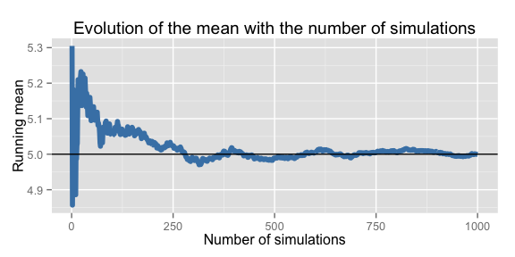
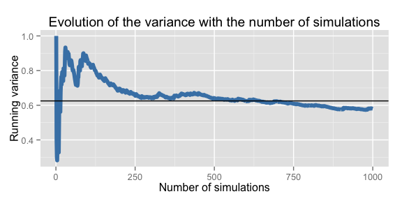
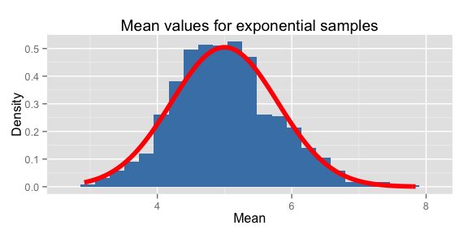
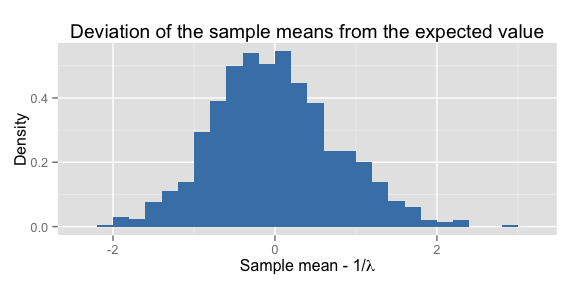
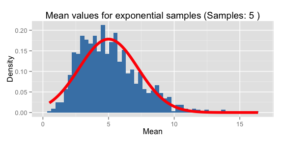
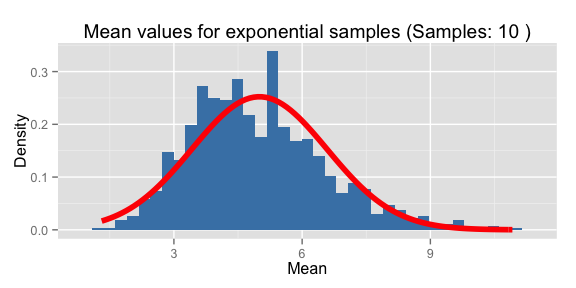
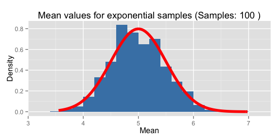

# Exploration of the Expoential Distribution
Brett Jackson  


## Overview
The goal of this study is to explore the properties of the Central Limit Theorem
by drawing drawing samples from an exponential distribution, and calculating the
sample mean. This is performed many times using simulations, and the
properties of the distribution of the sample mean are studies.


```r
library(ggplot2)
```

## Simulations

```r
lambda <- 0.2
n.samples <- 40
n.simulations <- 1000
```

For this project, many simulations are run by drawing random number from the
exponential distribution. An example rate parameter of 0.2 is selected
for this exercize. 1000 are run, each drawing 40 values,
and taking their mean.
From the Central Limit Theorem, the distribution of the sample mean of repeated
samplings from an arbitrary distribution will aproach a Gaussian distribution
with mean and variance given by

```r
exp.mean <- 1./lambda
exp.var <- 1./lambda^2/n.samples
bin.width <- (exp.mean+2*sqrt(exp.var))/30 # bin width used for histograms
```

Thus, the expected mean and variance of repeated samplings of the
exponential distribution of interest are 5 and 0.62
respectively.

The sample mean of 1000 simulations, each drawing 40
samples, are calculated using the following R code chunk.


```r
means <- apply(matrix(rexp(n.samples*n.simulations, rate=lambda),
                      nrow=n.simulations), MARGIN=1, FUN=mean)
```

The running mean and variance are also calculated for later use.


```r
# compute the running mean and variance 
running.mean <- cumsum(means)/(1:n.simulations)
running.var <- vapply(1:n.simulations,
                      FUN=function(i) {
                        if (i>1) { var(means[1:i]) } # var of elements 1:i
                        else { 1. } # default value of 1
                      }, FUN.VALUE=1)

# Store these vectors in a data frame
data <- data.frame(x=1:n.simulations, means, running.mean, running.var)
```


## Sample Mean versus Theoretical Mean
The expected mean of the distribution of sample means is
5. This is shown by plotting the evolution of the mean of
sample means with the number of simulations. The horizontal line
represents the expected sample mean.


```r
ggplot(data, aes(x=x, y=running.mean)) +
  geom_line(size=2, color='steelblue') + geom_hline(yintercept=exp.mean) +
  labs(x='Number of simulations', y='Running mean',
       title='Evolution of the mean with the number of simulations')
```

 

This plot shows after large variations in the mean with a low number of
simulations due to statistical uncertainties, the running mean quickly becomes
stable near th exepected value of 5. 
A plot of the deviation of the sample mean from the theoretical value is shown
in the appendix.

## Sample Variance versus Theoretical Variance
The evolution of the variance of sample means is shown as the number of
simulations increases. The horizontal line represents the epxected variance of
0.62.


```r
ggplot(data, aes(x=x, y=running.var)) +
  geom_line(size=2, color='steelblue') + geom_hline(yintercept=exp.var) +
  labs(x='Number of simulations', y='Running variance',
       title='Evolution of the variance with the number of simulations')
```

 

This plot shows as the number of simulations increase, the variance of the
sample means approach the expected value of 0.62.

## Distribution
The Central Limit Theorem states that for sufficiently large sample size, the
distribution of sample means should be approximately Gaussian.
To show this, a normalized histogram of the 1000
sample means is plotted, and overlayed with a Gaussian distribution with the
expected mean and standard deviation.


```r
ggplot(data, aes(means)) +
  geom_histogram(aes(y=..density..), binwidth=bin.width, fill='steelblue') +
  stat_function(fun=dnorm, color='red',
                args=list(mean=exp.mean, sd=sqrt(exp.var)), size=2) +
  labs(x='Mean', y='Density', title='Mean values for exponential samples')
```

 

This plot shows that the distribution of sample means is roughly Gaussian.

## Appendix

### Deviation of sample mean from expected value
Another simple test to show the sample mean is centered around the theoretical
mean is to simply plot the difference between the sample mean and the expected.
If this difference is centered around zero, it indicates the sample mean is well
predicted by the expected mean from theory.

```r
# deviation of each sample mean from the expected mean
mean.diff.from.expected <- means - exp.mean
data <- cbind(data, mean.diff.from.expected)

ggplot(data, aes(mean.diff.from.expected)) +
  geom_histogram(aes(y=..density..), binwidth=lambda, fill='steelblue') +
  labs(x=expression(paste('Sample mean - 1/',lambda)),
       y='Density',
       title='Deviation of the sample means from the expected value')
```

 

Indeed, the deviation from the expected value is centered around zero,
indicating the sample mean is well predicted by the value from theory.

### Increasing the number of samples
In this section, the number of samples drawn in each simulation is increased,
and the distribution of sample means is drawn for several choices of the number
of samples to show how the shape changes with the number of samples drawn in
each simulation


```r
DrawMeanDist <- function(lambda=0.2, n.simulations=1000, n.samples=40) {
  # compute expected mean and variance
  exp.mean <- 1./lambda
  exp.var <- 1./lambda^2/n.samples
  bin.width <- (exp.mean+2*sqrt(exp.var))/30

  # calculate the mean for each of 
  means <- apply(matrix(rexp(n.samples*n.simulations, rate=lambda),
                        nrow=n.simulations), MARGIN=1, FUN=mean)
  data <- data.frame(x=1:n.simulations, means)
  
  # draw normalized histogram of sample means
  ggplot(data, aes(means)) +
  geom_histogram(aes(y=..density..), binwidth=bin.width, fill='steelblue') +
  stat_function(fun=dnorm, color='red',
                args=list(mean=exp.mean, sd=sqrt(exp.var)), size=2) +
  labs(x='Mean', y='Density', title=paste('Mean values for exponential samples',
                                          '(Samples:', n.samples, ')'))  
}
```


```r
DrawMeanDist(n.samples=5)
```

 

```r
DrawMeanDist(n.samples=10)
```

 

```r
DrawMeanDist(n.samples=100)
```

 

These plots show that as the number of samples increase, the distribution of
mean values becomes closer to a Gaussian distribution as suggested by the Mean
Value Theorem.
